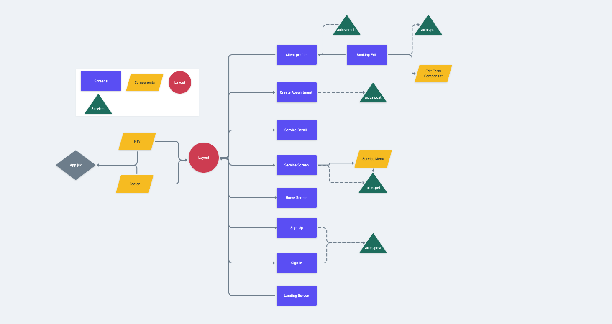
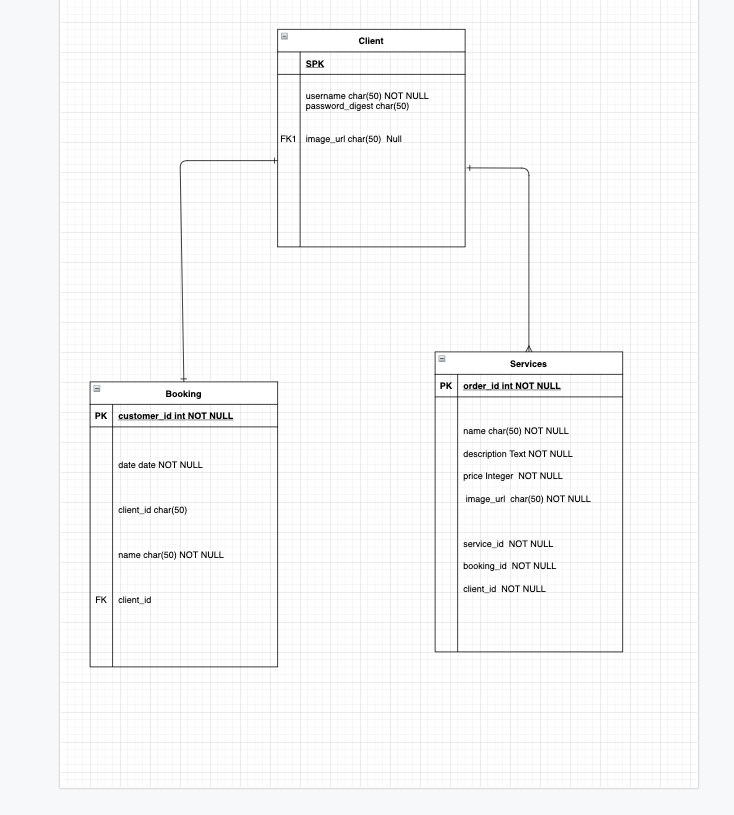

# TheBarbershop

## Overview
TheBarberShop is an app using React on Rails. I was inspired to created this for a friend's Barber Shop. A user will be able to create a profile and have the ability to select services. They can also create, edit , and delete appointment. 

## MVP
- Back end Full CRUD
- Full CRUD for Client for end
- 8 Component 
- Css with Flex Box or Grid

## Libraries and Dependencies
| Library | Description |                      
| :-------: | :------------: |
| React | npm i in the client folder |
| React Router | npm i react-router-dom |
| axios | npm i |
| rails | bundle |
| bcryt | uncomment in Gemfile then run bundle | 

## Client (Front End)

### WireFrames


### Component Tree



### Component File Structure
```structure
src
|_components
    |_Layout
    |_Nav
    |_Footer
    |_Service Menu
    |_Edit Form

|_screens
    |_Landing Page
    |_sign in
    |_sign up
    |_home
    |_service
    |_service detail
    |_create appointment
    |_client profile
    |_booking edit

|_service
  |_apiConfig
  |_client
  |_services
  |_booking    
```


  ### TimeFrame

| Task | Priority | Estimated Time | Time Invested | Actual Time |
| :----| :--------: | :-----------: | :-----------: | :-----------------: |
| WireFrame| H | 3 | 0 | 0 |
| Component | H | 3.5 | 1.5 | 1.5 | 
| File Structures | H | 1 | 1 | 1 |
| Model | H | 2 | 0 | 0 |
| Seeds | H | 2 | 0 | 0 |
| Controllers | H | 3 | 0 | 0|
| routes | H | 2 | 0 | 0 |
| Screens | H | 2 | 0 | 0 |
| Components | H | 2.5 | 0 | 0 |
| Services | H | 3 | 0 | 0 |
| Auth | H | 3 | 0 | 0|
| Testing | H | 3 | 0 | 0 |
| Debugging | H | 3 | 0 | 0 |
| Basic Css | H | 3 | 0 | 0 |
| Animations | L | 3 | 0 | 0 |


## Server (Back End)

### ERD



### Post-MVP
- Add a Barbers Table
- Admin Auth for Barbers Only
- Check Out Cart 
- Barbers reviews
- Live rendering Calender

### Code Showcase


### Code Issues & Resolutions
